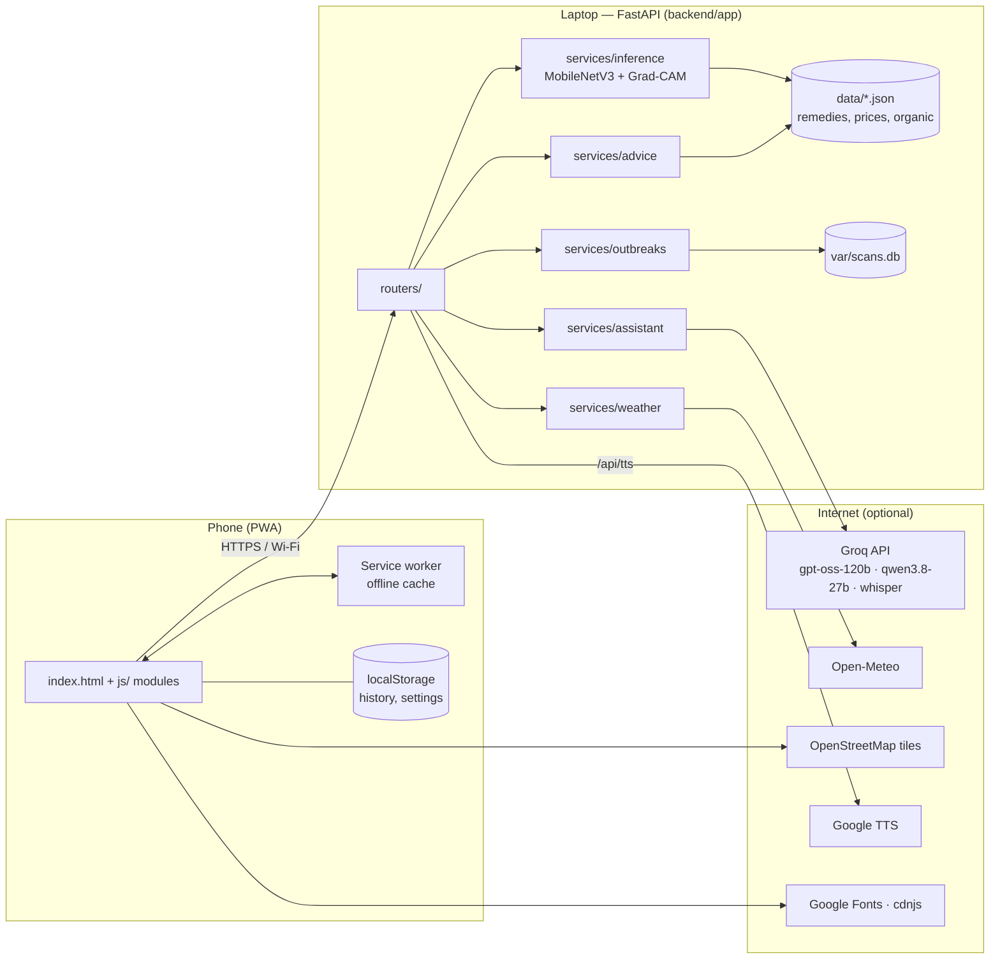
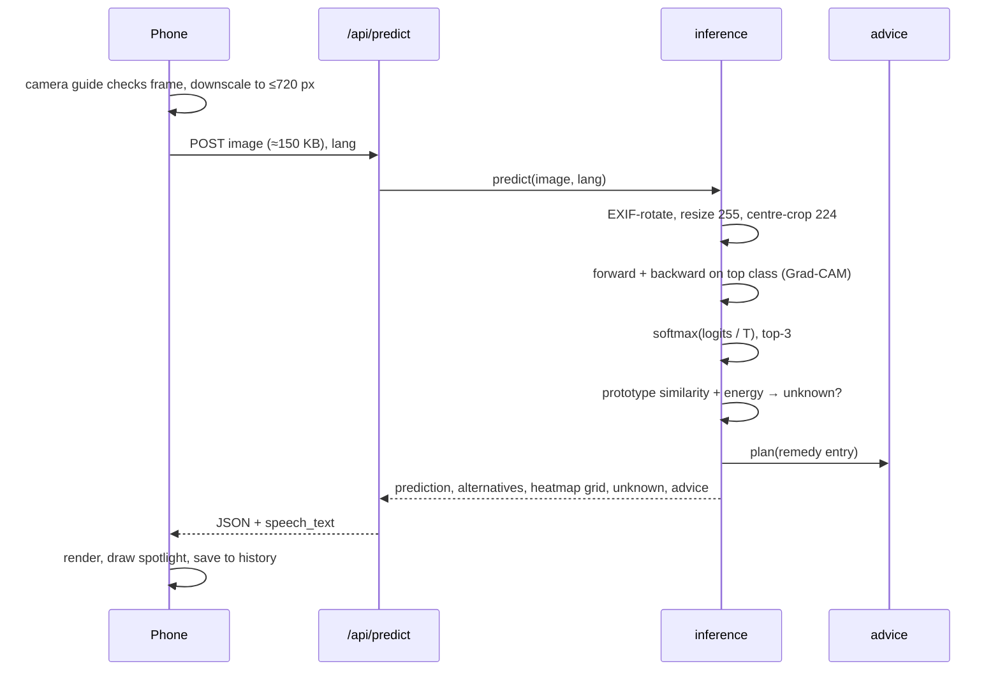
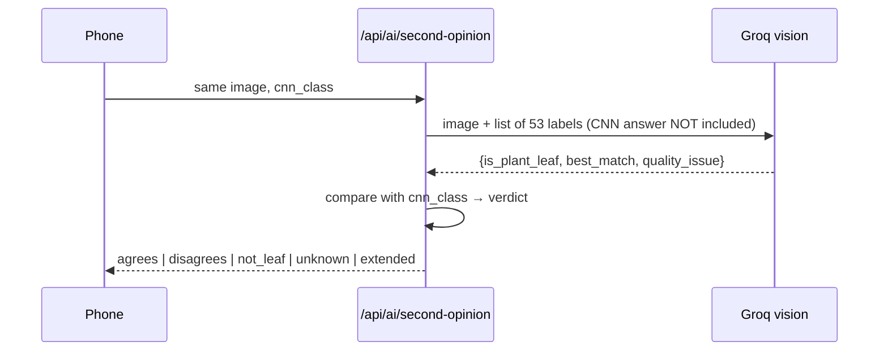
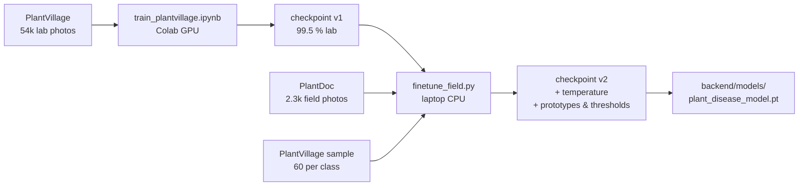

# Architecture

How the app is put together, and why. For endpoint details see [API.md](API.md); for the
model see [MODEL_CARD.md](MODEL_CARD.md).

## 1. Overview

One laptop runs a FastAPI server that holds the CNN and serves the Progressive Web App.
Phones reach it over Wi-Fi or through a Cloudflare Tunnel. The internet is only needed for
the optional extras: the Groq AI assistant, weather, map tiles and server-side speech.



## 2. Backend layout

```
backend/app/
  main.py        FastAPI app, lifespan (loads the model), routers, static PWA
  config.py      every path, environment variable and constant
  ratelimit.py   sliding-window limiter keyed on CF-Connecting-IP behind the tunnel
  routers/       thin HTTP layer: validation, status codes, response shape
  services/      the work: no FastAPI imports except where unavoidable
  ml/model.py    architecture + transforms, imported by training/ too
```

**Rules the code follows**

- Routers validate and translate errors; services never raise `HTTPException`.
- Every path and constant lives in `config.py`; nothing else computes `Path(__file__)`.
- Knowledge (`data/`) is versioned; runtime state (`var/`) is git-ignored.
- The phone never supplies advisory text or doses — it sends a class name and the server looks
  up the rest. This is what stops a tampered request from feeding the AI fake doses.

## 3. Request flows

### 3.1 Diagnosis



One forward pass gives the logits, the penultimate features (for the unknown check, via a
forward hook) and the activations of the last conv block (for Grad-CAM). The only extra cost
is one backward pass, about as long as the forward.

### 3.2 AI second opinion



The vision model is deliberately not told what the CNN said, so it cannot simply agree.
It runs after the CNN result is already on screen, so it never slows the diagnosis.

### 3.3 Chat

The phone sends only the conversation, the class name, confidence, alternatives, the vision
model's disagreeing class (if any) and, if shared, a rounded location. The server builds the
system prompt from `remedies.json` (English + the farmer's language), adds the second advisory
when the models disagree, adds the 48-hour forecast, and streams the answer as plain text.

## 4. Machine learning pipeline



The checkpoint is self-describing: architecture name, image size, class list, weights,
metrics, and (from v2) `temperature` and `ood` statistics. Older checkpoints without them
still load; the app then skips calibration and the unknown check.

Checkpoints are loaded with `torch.load(weights_only=True)`, so a tampered file cannot run
code on the server.

## 5. Frontend

Vanilla JavaScript ES modules, no build step, served by FastAPI under `/app/`.

| Module | Responsibility |
|---|---|
| `js/app.js` | Screens, tabs, diagnosis flow, chat, voice, cost card |
| `js/camera.js` | Live camera guide; `analyse()` is pure and unit-testable |
| `js/heatmap.js` | Draws the 7×7 Grad-CAM grid as a spotlight on a canvas |
| `js/history.js` | Scan history in `localStorage` (thumbnails, class names) |
| `js/weather.js` | Location permission, spray-timing card, 48-hour ribbon |
| `js/map.js` | Lazy-loads Leaflet (cdnjs, SRI-pinned), draws outbreak cells |
| `js/i18n.js` | Every string in Marathi, Hindi, English |

**Offline strategy** (`sw.js`):

| Request | Strategy | Why |
|---|---|---|
| App shell, modules, CSS | Network first, cache fallback | Updates reach phones; still opens offline |
| Google Fonts, cdnjs | Cache first | Versioned URLs never change |
| `/api/advisory/*`, `/api/classes` | Network first, cache fallback | Reopen saved scans offline |
| `/api/predict`, AI, weather | Never cached | A stale diagnosis is worse than none |

**Speech.** The browser voice is used when the phone has one for the language (instant,
offline). Almost no phone ships Marathi, so the app falls back to `/api/tts` (gTTS, cached
on disk by text hash).

## 6. Browser capability matrix

| Feature | `http://localhost` | `http://192.168.x.x` (Wi-Fi) | `https://…trycloudflare.com` |
|---|---|---|---|
| Diagnosis, advisory, voice output | Yes | Yes | Yes |
| Live camera guide | Yes | No — phone camera app | Yes |
| Location (spray timing, map sharing) | Yes | No | Yes |
| Voice questions (microphone) | Yes | No | Yes |
| Install as app (service worker) | Yes | No | Yes |

Browsers only expose camera, location, microphone and service workers to secure origins.

## 7. Configuration

All in `.env` (see `.env.example`):

| Variable | Default | Purpose |
|---|---|---|
| `GROQ_API_KEY` | empty | Enables the AI assistant |
| `GROQ_CHAT_MODEL` | `openai/gpt-oss-120b` | Chat model |
| `GROQ_VISION_MODEL` | `qwen/qwen3.8-27b` | Second-opinion model |
| `GROQ_STT_MODEL` | `whisper-large-v3-turbo` | Speech-to-text |
| `AI_RATE_LIMIT_PER_MIN` | 20 | AI requests per visitor per minute |
| `PORT` | 8000 | Used in the printed LAN address |
